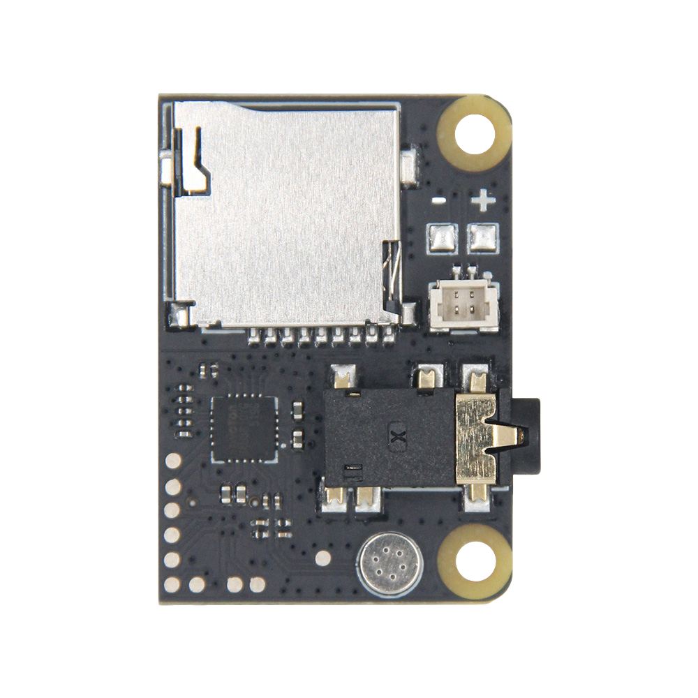

  

<h1 align = "center">🌟LilyGo T-SIM7600G-S3-Standard-ExpansionKit Usage Guide🌟</h1>

<!-- [English](./README.MD) | [中文](../../../cn/shield/t-bat/README.MD) -->

# Standalone shield

  

# After installation

  

### Parameters

| Features                     | Details          |
| ---------------------------- | ---------------- |
| Mono decoder                 | NAU8810YG        |
| Audio power amplifier        | NS4150B(3Wx1@4Ω) |
| Headphone jack               | CTIA             |
| Audio power output interface | SH 1.0mm 2Pin    |
| SD card interface            | 4-Bit/Up to 32GB |
| Microphone sensitivity       | 36-38db          |

## Schematic

[schematic](../../../../schematic/standard/T-SIM7600G-S3-Standard-ExpansionKit_Rev1.0.pdf)

## Examples

- [PlayModemSDMusic](../../../../examples/ModemPlayMusicFromSD/ModemPlayMusicFromSD.ino)
- [RecordAndPlay](../../../../examples/ModemRecordPlayback/ModemRecordPlayback.ino)

## AT Command datasheet

- 
